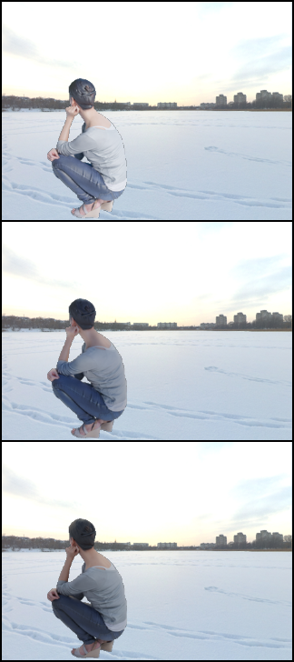
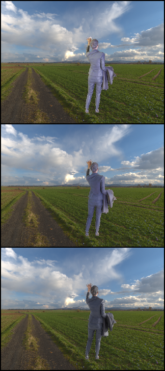
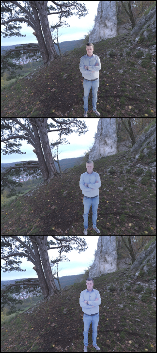

# NeSF: Neural Shading Field for Image Harmonization
 Anonymous code  for CVPR 2022 review

## Training
We provide a mini-dataset for training our model. Specifically, our training has two stages: training the Neural Rendering Framework and training the Background Illumination Estimation Module. 

Stage1: set a config file in configs/config_stage1.json, and run as following:

    python train_stage1.py

Stage2: set a config file in configs/config_stage2.json, and run as following:

    python train_stage2.py

## Inference
Set a config file in configs/config_inference.json, and run as following:

    python inference.py

Examples results:

  
  
  

